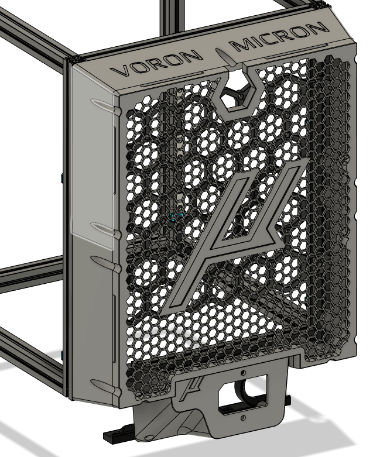

This is a mod to expand electronics space also to the back of the printer, mainly because I didn't have an UHP PSU available at the time.

## Notes:
- Everything in this mod is tailored on the hardware I have on hand. Feel free to grab the CAD and adapt whatever modification you like.
- My actual Micron "version" is stuck at the early months of 2022. I know that many improvements have been done in the meantime, keep that in mind.
- My actual backpack is modeled to replace the back panel clips, with the *Walls_Bottom_Half_x1.stl* and *Walls_Top_Half_x1.stl* used to keep the back panel in place.
Those pieces are modeled in order to use 4mm panel with 3mm foam gasket. If you have a different foam/panel combo it should be easy to tweak dimensions in CAD.
- In order to allow passage for the cables (granting communicatio between lower and rear electronics bay), a modified skirt is needed. Actually only the "flat" z motor cover is supported.
- In order to be able to put whatever you like in the electronics bay, instead of attaching things directly to rear panel, I'm using the *Electronics_Custom_Support_x1.stl* element as a sort of "pegboard", secured to the frame.
Each hole in the model can house an heatset insert, and you can design whatever support you need to be bolted in those inserts.

## BOM:
- 16 6x3 magnets
- various sized M3 bolts
- heatset inserts

## Streamlined instructions
- Load M3 nuts according to following image:

- replace rear skirt with *Modified_Rear_Skirt_x1.stl*, put two insert in lower holes, and secure the *AC_Inlet_Cover_x1.stl* to both the frame and the skirt.
The AC inlet element will also act like a panel clip, so it's a good idea to have it already in place at this stage.
- Route the needed wires now, it'll be more difficult later.
- Secure the *Electronics_Custom_Support_x1.stl* to the frame. Anchoring points will act like panel clips. Heatset inserts can be inserted also later.
- Place *Walls_Bottom_Half_x1.stl* and *Walls_Top_Half_x1.stl* on the panel and secure them to frame
- Glue magnets in place and attach the *Cover_Plate_x1.stl*

